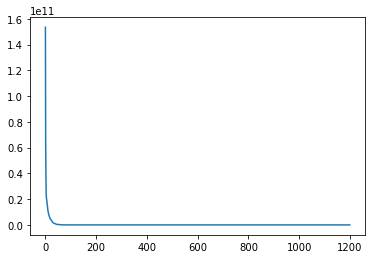

# Metaheuristics Exam
# João Luis Brasil Gondim

## Part 2: Continuous optimization

## 1. Choice of algorithm
<font size="3">The paper K. Tang et al. (2008), *Benchmark Functions for the CEC’2008 Special Session and Competition on Large Scale Global Optimization*, cites several options of algorithms used to search for the optimum of the given functions: simulated annealing (SA), evolutionary algorithms (EAs), differential evolution (DE), particle swarm optimization (PSO), Ant Colony Optimisation (ACO), Estimation of Distribution Algorithms (EDA), etc.<p>
I chose the PSO algorithm. I am relatively well acquainted to it and it can be easily implemented.<p>
</font>

## 2. Parameters
<font size="3">The PSO algorithm has some parameters to tune: the inertia factor (W), the self confidence factor (c1), the swarm confidence factor (c2) and the number of particles.<p> In order to search for the best alternative in the domain of these parameters, I built a Hyperparameter Optimizer, <b>class HO_PSO_hyperparameter_optimizer(), that uses a 2-step grid search algorithm</b>:<p>
- <u>First step:</u> the <b>grid_search_candidates() method</b> runs different parameter combinations and store them along with their fitness result.<p>
- <u>Second step:</u> the <b>select_best_candidate() method</b> runs each candidate (usually the six ones with best fitness in the first step) several times (usually 10 times) and computes the minimal, maximal, average and standard deviation fitness.<p>
The optimal parameter combination was chosen among the candidates with smallest average and standard deviation fitness.<p>
The tables below summarize the optimal parameters for each function.<p>

#### <center>Table 1. PSO Parameters (dimensions = 50)</center>
| Function | W | c1 | c2 | Particles |
| :-: | :-: |  :-: | :-: | --: |
| F1 | 	0.1 | 0.8 | 2.4 | 500 |
| F2 | 	0.1 | 1.4 | 2.4 | 500 |
| F3 | 	0.12 | 1.2 | 2.8 | 1,500 |
| F4 | 	0.1 | 0.7 | 2.6	| 500 |
| F5 | 	0.15 | 1.7 | 2.2 | 100 |
| F6 | 	0.3 | 1.9 | 2.1	| 100 |


#### <center>Table 2. PSO Parameters (dimensions = 500)</center>
| Function | W | c1 | c2 | Particles |
| :-: | :-: |  :-: | :-: | --: |
| F1 | 	0.1 | 1.0 | 2.49 | 500 |
| F2 | 	0.1 | 1.5 | 2.7 | 500 |
| F3 | 	0.02 | 1.8 | 3.0 | 3,000 |
| F4 | 	0.1 | 0.7 | 2.6 | 2,000 |
| F5 |  0.05 | 1.7 | 2.2 | 500 |
| F6 | 	0.1 | 1.9 | 1.9 | 500 |

</font>

## 3. Results
<font size="3">Table 3 summarizes the results for each function.
</font>

#### <center>Table 3. PSO Results</center>
| Function | Dim = 50 | Dim = 500 | Optimum |
| :-: | --: |  --: | --: |
| F1 | 	-445.8 | 48.8 | -450 |
| F2 | 	-435.7 | -351.1 | -450 |
| F3 | 	797.8 | 129,167.6 | 390 |
| F4 | 	347.8 | 8,120.0 | -330 |
| F5 | 	-179.8 | -178.0 | -180 |
| F6 | 	-118.9 | -118.9 | -140 |


<font size="3">The following sections show the execution of the PSO algorithm for the best parameter alternative chosen for each problem and number of dimensions.

## - F1: Shifted Sphere Function
### a) Dim = 50
#### - <u>Stopping criterion</u>
The algorithm ran for 1000 steps. This was enough to show convergence.
#### - <u>Computational time</u>
Wall time: 22.5 s
#### - <u>Solution</u>
Optimal point: see below.
#### - <u>Fitness</u>
Function value: -445.8007655725334
#### - <u>Convergence curve</u>
See below.


```python
%%time
PSO_Optimizer(0, 50, 500, 0.1, 0.8, 2.4, 0, True)
```

    func_number: 0
    n_particles: 500 n_dim: 50
    W: 0.1 c1: 0.8 c2: 2.4
    The optimum is 
     [ 97.34863352  76.65027978 -19.01694682  25.75210633 -22.8895671
      69.87020119   5.19465663  60.76013922 -21.08481857  92.00387685
     -94.21538725  90.81972853  42.67275828  29.25998889 -10.24006813
     -64.88529875  67.0768679   93.80346337 -73.12593115 -50.25983504
      81.95601476  35.16872704  24.39328973   2.22537895 -99.50625249
     -54.79035599  95.55725868  72.07569041 -96.72624381  -2.67869652
     -16.76687243  54.25498481  -2.42330298   4.9575373   56.69006003
      18.54283585 -74.8315426  -78.48171825  32.84416727  99.62447012
     -31.26288823 -65.0663501  -86.50013016 -38.79304272 -33.42448417
     -24.58610656  90.17535169  44.16269658  56.25579301  23.73464694]
    The value of F at the optimum is: -445.8007655725334
    Wall time: 22.5 s
    


    (-445.8007655725334, 1000)


### b) Dim = 50
#### - <u>Stopping criterion</u>
The algorithm ran for 1000 steps. This was enough to show convergence.
#### - <u>Computational time</u>
Wall time: 3min 27s
#### - <u>Solution</u>
Optimal point: see below.
#### - <u>Fitness</u>
Function value: 48.83810526051144
#### - <u>Convergence curve</u>
See below.


```python
%%time
PSO_Optimizer(0, 500, 500, 0.1, 1.0, 2.49, 0, True)
```

    func_number: 0
    n_particles: 500 n_dim: 500
    W: 0.1 c1: 1.0 c2: 2.49
    The optimum is 
     [ 9.57390258e+01  7.64424485e+01 -1.73819986e+01  2.49369414e+01
     -2.34836257e+01  6.84977845e+01  4.88457427e+00  6.18445852e+01
     -2.06518067e+01  9.27290881e+01 -9.46306686e+01  9.12769676e+01
      4.27249994e+01  2.93552390e+01 -9.59401867e+00 -6.37243872e+01
      6.79600163e+01  9.35154927e+01 -7.25583673e+01 -5.08576874e+01
      8.18363111e+01  3.63634268e+01  2.39771180e+01  1.47233028e-01
     -1.00063818e+02 -5.46255394e+01  9.51643322e+01  7.30935806e+01
     -9.59824130e+01 -2.69275823e+00 -1.65150614e+01  5.32345861e+01
     -1.93080119e+00  4.96021237e+00  5.73733248e+01  1.78023472e+01
     -7.64064775e+01 -7.80399076e+01  3.26379009e+01  9.90187699e+01
     -3.08873654e+01 -6.40837201e+01 -8.57991211e+01 -3.96951602e+01
     -3.24126808e+01 -2.58771425e+01  9.01167347e+01  4.33528678e+01
      5.52638084e+01  2.20975237e+01  3.00058253e+01  5.06519906e+01
     -6.89223304e+01  2.05547476e+01  8.06176503e+01 -6.68586742e+01
      6.47636687e+01 -8.59204256e+01  9.06970897e+01 -3.63765358e+01
     -9.81365373e+01  5.29279044e+01 -3.80416946e+01  4.33540787e+01
     -8.46128796e+01  7.07463869e+01  4.37116344e+01  7.34437076e+01
      7.50243347e+01  5.28306616e+01  3.37386883e+01  8.21716967e+01
      6.56649593e+01  6.71882006e+01  2.81673032e+01 -6.90380323e+01
      5.73867776e+01  4.54776428e+01  1.31259712e+01  4.57103488e+01
     -5.03737587e+01 -2.30884182e+00 -1.49334573e+01  5.90566034e+01
      5.28206087e+01 -5.28012597e+01  2.59922794e+01 -5.37668161e+01
      2.42712613e+01 -4.60609125e+01  9.85386038e+01  5.30578498e+01
     -3.05894284e+00  8.84347367e+01 -2.75502337e+01 -8.25474837e+01
      8.92582267e+01  3.65030741e+01  2.23798956e+01  7.66206642e+01
     -9.75028217e+01 -4.08874373e+01  9.34697056e+01 -7.86070305e+01
      1.99862689e+01 -5.56550592e+00  4.51790509e+01  7.15965050e+01
     -6.29618507e+01 -6.73125622e+00  8.04085213e+01 -9.55294051e+01
      5.32099057e+01  6.06171457e+01 -3.61527536e+01 -5.22803872e+01
      2.37753051e+00  3.73598771e+01  9.04115115e+01 -1.26420846e+01
     -2.78460171e+00 -8.02684915e+01  1.03438836e+01 -1.35816413e+01
     -6.19688225e+01 -6.90690487e+01  8.81502948e+01 -7.36182009e+01
      9.96235178e+01  4.07302461e+01  9.44799374e+01  5.49966196e+01
     -9.96356061e+01 -3.50701872e+01  8.53045405e+00 -3.73123815e+01
      3.47666846e+01 -3.06392911e+01  9.69612149e+01 -2.93418111e+01
     -9.74413872e+01  6.23733208e+01  9.69359043e+01 -3.74014132e+01
     -2.53268495e+01  5.18497946e+01 -1.24218117e+01 -8.07674827e+01
      9.97713353e+01  6.25500710e+00 -7.26151830e+01 -7.50373229e+01
      7.16545636e+01  4.25810997e+01  1.00810970e+02  6.25853714e+01
      5.60760179e+01  5.36285374e+01  8.15350561e+01 -8.12206863e+01
     -5.78634613e+01  6.95412268e+01  4.84708451e+01 -1.98814071e+01
     -3.75702339e+01 -4.00897904e+00 -7.08413456e+01  6.65950442e-01
      7.64592817e+00  3.18074136e+00 -5.52803833e+01  8.77305127e+01
      3.28538812e+00 -9.01877900e+00  5.45945283e+01  4.56105131e+01
      2.13625694e+01 -8.75091028e+01 -8.59546449e+01  2.70887307e+01
      7.29369284e+01 -1.45090027e+01  4.35659594e+01 -8.43437173e+01
     -9.62828722e+01  3.83002207e+00  7.31035414e+01  6.08689317e+01
      6.04249563e+01 -6.18839965e+01  4.27578150e+01 -5.68444846e+01
      5.56649999e+01 -6.53273228e+01 -5.89300029e+01 -6.45228669e+00
     -8.51675755e+01  2.09182257e+01 -6.21969273e+01  8.72740659e+01
     -3.83071995e+01 -7.53460613e+00  6.76088396e+01 -4.08339873e+01
      4.22482187e+01 -8.55533977e+01  5.14920950e+01 -5.76872078e+00
      8.95391443e+01 -9.63759372e+01 -8.91883583e+01  4.73365645e+01
      2.80570668e+01  8.65918912e+01 -7.46934886e+00  3.01740967e+00
     -1.49939940e+01 -1.75492319e+01 -2.05738090e+01  7.14538361e+01
      6.45870911e+01  8.39819628e+01  6.64032896e+01  7.25964452e+01
      5.58531064e+01 -1.34839880e+01 -1.44759541e+01 -5.48699512e+01
     -9.53785721e+01 -2.52747708e+01  6.80873686e+01 -4.20328115e+01
     -4.17170372e+01 -3.26770044e+01 -3.35793922e+00 -5.54972854e+01
      9.35460878e+01 -3.96373887e+01  5.42306926e+01  7.89202499e+01
     -4.97800075e+01 -7.04456615e+01 -3.35728641e+01  4.63487987e+01
     -9.55286133e+01  7.46248312e+00  1.22454036e+01  3.48083767e+01
      1.44228544e+01  3.69382482e+01  5.39823154e+01  8.02271803e+01
      9.41532847e+01  8.03864226e+01 -6.53079034e+01  9.44033260e+01
      8.04962372e+01 -9.32682265e+01 -4.32067913e+01 -6.18428199e+01
      2.00461593e+01 -5.88085328e+01  9.90248333e+01 -9.76770254e+01
     -1.27779040e+01 -6.86498512e+01  2.38827934e+01  5.02741858e+01
     -4.49944321e+01  5.75918444e+00 -3.53991213e+01 -6.45649065e+01
      5.53184605e+01  6.18266174e+01  4.47442686e+01 -9.17572127e+01
      2.31861695e+01 -3.08017043e+01  1.77574534e+01  8.26653432e+01
     -4.58129723e-01 -1.67407859e+01  5.87460885e+01  7.80821174e+01
      1.51133107e+00 -2.09774050e+01  8.50390336e+01 -4.36637690e+01
      5.30441350e+01  4.55279602e+01  8.26278851e+01 -7.89323384e+01
      7.80064077e+01  1.87543928e+01 -9.76636893e+01 -5.35173631e+01
     -7.58535893e+01  7.68672704e+01  6.28584505e+01  5.15579303e+01
      6.19929806e+01  3.59025054e+01  2.46638731e+01 -2.57621741e+01
     -6.01675132e+01 -4.60065922e+01 -4.03683895e+00 -2.12271635e+01
      3.98719042e+01 -3.48836394e+01 -9.08550936e+01  5.65783513e+01
      1.11795811e+01 -8.60690832e+01 -5.53301765e-01  6.70285928e+01
     -7.41333589e+00  5.61893807e+01 -2.75836278e+00  3.86938465e+01
      9.55428437e+01 -3.20057419e+01  2.53820257e+01  3.63200540e+00
      6.14615571e+01 -2.36416186e+00  4.61212661e+01  3.99656938e+01
      6.70702937e+01 -9.78840274e+01 -9.09005982e+01  1.35177106e-01
     -4.18282194e+01 -9.67190254e+01  5.80428997e+01 -8.41722699e+01
     -4.04565720e+01 -3.23436916e+01  6.46242695e+01 -9.64611802e+01
     -7.13303417e-01  2.19030797e+01 -2.48603381e+01 -5.95030293e+01
      7.83899352e+01  9.97859292e+01  8.43903967e+01 -2.28445930e+01
      3.21569114e+01  9.90289616e+00 -5.61443479e+01 -4.00134529e+01
     -9.73284626e+01 -9.97149025e+01  9.71019302e+01  6.21070751e+01
      5.63513217e+01  8.05858191e+01 -7.31561640e+01 -8.21570247e+01
      9.83658495e+00 -9.81703171e+01 -7.65496781e+01 -8.87979035e+01
      5.42814886e+01 -8.51777078e+01  4.27856774e+01 -7.24935324e+01
      2.21186352e+01 -5.04784979e+00  1.68268453e+00 -2.98296634e+01
     -8.41054896e+01 -4.99522539e+01  4.69986561e+00 -7.19524839e+01
     -7.52472370e+01  1.47955245e-02 -4.15003077e+01 -7.75090492e+01
     -9.71357943e-01 -2.26852486e+01 -4.47322874e+01  8.92476210e+01
     -8.81485721e+00 -5.17308290e+01  6.57144245e+01 -3.90922874e+01
     -9.43515169e+01  9.72004626e+01 -4.54681093e+00  2.01942982e+01
      5.18154412e+00  9.64206773e+01 -5.06231406e+01  3.43526559e+01
     -7.05208990e+01 -1.98980524e+01 -6.97844906e+01 -3.19814193e+01
      1.05747399e+01 -9.16495140e+01 -5.41409868e+01 -1.92709715e+01
     -7.59478096e+01 -1.36834777e+01 -8.76988743e+01  1.00172503e+02
      4.06494618e+01  2.19516325e+01  2.18682963e+01  6.75043397e+01
      9.48337813e+01 -1.22257152e+01  6.98671021e+01 -2.17498419e+01
     -1.67294383e+01  8.02573143e+01 -3.01001413e+01  6.14816746e+01
      9.83113697e+01  5.65564034e+01  7.12089849e+01  3.22699018e+01
     -4.46358342e+01 -5.22984998e+01 -1.43200385e+01  1.97845760e+01
     -1.71672446e+01  5.38053018e+01 -9.54046387e+01  3.92413618e+01
      5.04845510e+01  9.07411935e+01 -2.38283098e+01 -8.92935123e+01
     -2.58771088e+01  3.12822067e+01  4.01108448e+01 -8.31923379e+01
      8.86114890e+01  6.68404802e+00  8.34342928e+01 -3.80742329e+01
      4.51939061e+01 -2.34968690e+01  8.10537929e+01 -8.60891216e+01
     -4.66159916e+01  2.46124189e+01  3.47759789e+01  4.65576726e+01
      8.63700595e+01  2.34362944e+01  4.94885522e+01  3.04833221e+01
     -6.52535697e+01 -4.67454832e+01  6.34164346e+01 -1.83143782e+01
      3.22863032e+01 -4.31465292e+01  9.16421422e+01  1.77910602e+01
      9.42163258e+01  3.60588259e+00  7.09847135e+01 -5.42587415e+01
     -5.18794536e+01  8.13383805e+01  4.30634832e+01  9.51822646e+01
     -8.15088968e+00  4.79103750e+01  3.28680613e+01 -9.38460914e+01
     -3.07047763e+01 -8.36077294e+01 -8.90700671e+01  5.19461712e+01
      2.48963945e+01  6.02318438e+00  9.84508095e+01 -3.99988696e+01
     -6.52283979e+01  1.39343125e+01 -6.53058710e+00 -2.14914452e+01
     -9.57081508e+01 -3.04004922e+01  9.53318618e+01  1.47431503e+01
      5.35390561e+01  2.50793831e+01  4.65690223e+01 -6.95904718e+01
     -1.53503047e+01 -8.58856163e+01  7.63538518e+01  6.58310053e+01]
    The value of F at the optimum is: 48.83810526051144
    Wall time: 3min 27s
    


    (48.83810526051144, 1000)


## - F2 : Shifted Schwefel’s Problem 2.21
### a) Dim = 50
#### - <u>Stopping criterion</u>
The algorithm ran for 1000 steps. This was enough to show convergence.
#### - <u>Computational time</u>
Wall time: 23.3 s
#### - <u>Solution</u>
Optimal point: see below.
#### - <u>Fitness</u>
Function value: -435.67231217883295
#### - <u>Convergence curve</u>
See below.


```python
%%time
PSO_Optimizer(1, 50, 500, 0.1, 1.4, 2.4, 0, True)
```

    func_number: 1
    n_particles: 500 n_dim: 50
    W: 0.1 c1: 1.4 c2: 2.4
    func_number: 1
    n_particles: 500 n_dim: 50
    W: 0.1 c1: 1.4 c2: 2.4
    The optimum is 
     [-13.87318987 -19.11132519 -42.5648786  -82.1920879  -11.83196481
     -38.72447655  11.46268249 -70.90664981 -60.96281102 -46.6283121
     -47.66685555 -55.08704668 -17.66970949 -26.34962904 -73.35856128
     -58.75611546 -36.93426598 -28.72630753 -65.06849022 -62.33598091
     -33.8148472  -64.97003128 -54.01055168 -42.65622361  -0.41958164
     -34.11088214 -30.83896609 -59.0990939  -41.70430558 -35.81824991
     -62.52433342 -59.73211659 -36.88934045 -48.99011921 -85.05492206
     -67.59833647 -84.02464429 -39.41723876 -47.84042777 -50.24565468
      -3.96057846 -59.88563274 -29.24325599 -34.46177304  11.73060943
     -67.85830432   0.43139824 -53.96608176 -23.46102553 -69.62762384]
    The value of F at the optimum is: -435.67231217883295
    Wall time: 23.3 s
    


    (-435.67231217883295, 1000)


### b) Dim = 500
#### - <u>Stopping criterion</u>
The algorithm ran for 1000 steps.
#### - <u>Computational time</u>
Wall time: 3min 36s
#### - <u>Solution</u>
Optimal point: see below.
#### - <u>Fitness</u>
Function value: -351.14554075490895
#### - <u>Convergence curve</u>
See below.


```python
%%time
PSO_Optimizer(1, 500, 500, 0.1, 1.5, 2.7, 0, True)
```

    func_number: 1
    n_particles: 500 n_dim: 500
    W: 0.1 c1: 1.5 c2: 2.7
    func_number: 1
    n_particles: 500 n_dim: 500
    W: 0.1 c1: 1.5 c2: 2.7
    The optimum is 
     [ 1.08317509e+01  2.84767997e+01  1.85749225e-01 -4.84416244e+01
      2.30045808e+01  9.35361903e+00  1.83118431e+01  1.34202101e+01
      6.51544468e-01  2.11304956e+01  2.88829820e+00 -2.99273401e+01
     -5.64825295e+00 -9.54186508e+00 -5.56491990e+01 -7.27801376e+00
      7.81127689e+00 -1.05144152e+01 -1.37762394e+01  1.85703140e+01
      2.90327127e+01  1.24897744e+00 -8.12960377e+00  1.36416706e+01
      6.05490953e+00 -3.68948522e+01 -2.28910126e+01 -2.73351694e+01
      2.88932625e+01 -2.24428977e+01 -2.31588576e+01 -6.91240311e+00
     -3.60264854e+00 -3.76473251e+00  1.73213122e+00  5.89510482e+00
      1.32696334e+00  1.12493321e+01  1.27746699e+01  1.31780539e+01
     -3.20504071e-01  2.67155708e+01  1.68107484e+01 -1.29743721e+01
      1.11464241e+01  8.42407668e+00  1.26455755e+01  1.54871893e+01
     -1.00812320e+00 -1.48271066e+01 -6.02075153e+00  1.86053664e+01
      4.09444366e+01  2.95225703e+01 -5.26537471e+00  1.91570349e+01
      5.07009917e+00 -1.06168024e+01 -2.07328668e+01  2.21821879e+00
     -1.34626131e+01  1.64658209e+00  1.31041083e+01  5.15792134e+01
     -1.30621933e+01 -3.55500446e+01 -5.48087074e+00  3.42578374e+01
     -7.67833806e-01  2.84448167e+00  4.52605097e+01  7.22507443e+00
     -1.40589932e+01 -7.71030183e+00 -4.36546258e+01  2.48428947e+01
     -3.06740930e+01 -2.81224439e+01 -8.53189039e+00  1.36389095e+00
      3.30912117e+01  3.81797379e+01  1.64405445e+01  4.51768620e+01
      1.72955927e+01 -8.57429436e+00  2.43144852e+01 -2.70229645e+01
     -3.26139476e+00  9.65392390e+00  9.18933911e+00  1.50039636e+01
      5.20085507e+00  3.01492439e+00 -4.55608153e-01 -1.46992378e-01
      2.86384781e+00  2.24237668e+01 -9.23657252e+00 -6.14065952e+00
      4.26221579e+00  3.92616776e+00  2.12398611e+01 -1.35093981e+01
     -2.49731453e+01 -5.99796919e+00 -2.10105027e+00 -2.38807950e+01
     -4.17942473e+01 -2.39292047e+00 -2.31922245e+01  2.39709254e+01
      1.50435119e+01 -3.27502835e+00 -1.03131537e+00  4.00843382e+00
      3.11944406e+01  3.76780679e+00  1.36179285e+01 -3.59615737e+00
      1.80981717e+01 -2.92933155e+01  2.68034787e+01 -1.43548084e+01
      3.19266414e+01  5.87422536e+00  3.30731623e+00 -4.15641590e+01
     -1.80156563e+01  3.46404805e+01  7.02075585e+00 -2.09729534e+01
     -6.11197950e+00  2.73051682e+01 -2.51750027e+01 -7.71939685e+00
     -9.90368571e+00  3.51561509e+00  1.80006145e+00  9.66557969e+00
     -3.71425034e+01 -4.21361886e+00  8.80054907e+00  5.55304726e+00
      2.02163071e+01 -4.04596790e+01  4.28791234e+01  1.65765812e+00
      2.68422432e+00 -3.72472935e+01 -6.42705285e+01  1.73600289e+01
     -1.65939681e+01 -3.31431016e+01  1.80701710e+01 -3.05584465e+01
      6.97356165e+01 -7.32400397e+01  4.95203867e+01  2.68560236e+00
      7.54661689e+00  1.18889465e+01  3.53355863e+01  1.37710047e+01
      6.66215265e+00 -3.70656380e+01 -2.73455892e+01  7.50051297e+00
      1.27557639e+01  1.19821722e+00  3.08855567e+01 -5.27228860e+01
      4.56160399e+00  2.89706096e+01 -4.72063473e+01  2.82477474e+00
     -6.64397863e-01 -2.89194175e+01  1.57392453e+01 -1.56598733e+01
     -2.63035309e+01 -2.84518495e+01  1.83740635e+01 -2.28295258e+01
      4.28240009e-01 -3.06095314e+01 -2.14758708e+01 -4.10387565e+00
      1.86688651e+01 -4.15746577e+00  4.12572178e+00  3.06530665e+01
      6.11967475e+00 -1.81674260e+01  1.72346310e+01 -7.21252674e+00
      1.40070703e+01  1.67170196e+01  5.23698964e+00  3.62080386e+01
      2.47619849e+01 -1.56728433e+01 -4.35859328e+01 -3.14019871e+01
      1.99674675e+01  3.48764706e+00  3.05446292e+01  3.86518591e+01
      1.73861777e+00  2.35058525e+01  2.89013955e+01 -4.85244275e+01
      1.65328676e+01  1.88593870e+01 -1.22514879e+01  4.85177027e+01
      1.91982144e+01  5.68987577e+00 -2.48599771e+01 -3.88316429e+01
     -1.00589995e+01 -3.24675580e+01 -1.95572493e+01 -1.43384062e+00
     -1.43683554e+01 -1.30892845e+01  1.83122365e+01  1.42148612e+01
     -1.02166100e+01  2.14829153e+01 -7.13924651e-01  1.82923875e+01
     -8.65940185e+00  1.41784427e+01 -4.32870428e+00 -2.28798788e+01
     -1.47095103e+01 -8.89842006e+00 -3.08212863e+01 -4.45710092e+00
      2.17656691e+01  1.75180099e+01 -1.00630781e+01 -3.47206640e+01
      3.97439533e+01  1.17795273e+01 -7.85224849e+00  2.78363362e+00
     -2.94421851e+00  2.54600776e+01  7.92350552e+00  1.19913530e+01
      2.29138452e+01  1.72891544e+01  2.03307737e+01  2.11558113e+01
     -5.23541780e+01 -6.45446908e+00  1.25762529e+01  9.82552774e+00
     -1.81406760e+01  1.04305991e+01  4.19638251e+01 -5.44889898e+00
      2.95442631e+00 -2.76009743e+01 -3.46535493e+01  1.92029233e+01
      4.20815348e+01  1.44507976e+01 -3.34823249e+00 -3.81569761e+01
      2.79857391e+01 -6.00384924e+01 -1.01185893e+01 -2.34390577e+01
      4.07568359e+00  4.28676832e+01  2.03312794e+01 -2.23344175e+01
     -1.17612337e+00  3.62574525e+01  7.03029884e+00 -2.92926976e+01
     -5.31705040e+00  1.59118778e+01  2.04868121e+01  1.33923229e+01
     -3.13282142e+01  8.85080001e-01  1.22368775e+01  1.52869156e+01
     -2.82271291e+01 -1.13281309e+01  1.55587204e+01  1.21729026e+00
      1.03922234e+01 -4.06331899e+00 -4.11662108e+01 -7.70844386e+00
     -1.88673521e+01  2.88554592e+01 -3.16853783e+01  1.59731186e+01
      2.39516624e+00 -4.25672343e+00 -3.41109009e+01  1.82832652e+00
     -1.98390698e+01 -4.98294123e+00  9.08015303e+00  1.55574452e+01
      7.26856377e+00  5.44735624e+00 -1.61009399e+01 -2.24483883e+01
     -4.63640914e+00 -1.13582551e+01 -1.87946104e+00  3.57267982e+01
     -1.13284263e+01  1.45555101e+01 -2.85506691e+01 -1.36735121e+01
     -4.19393562e+01  1.49770065e+01  1.45138062e+01 -7.56648547e+00
     -1.27959709e+01  2.90428446e+01  1.65258785e+01 -8.98168609e+00
      7.04324703e+00 -2.95134649e+00 -2.16344660e+01  7.61283254e-01
     -6.07916312e+01  1.54322046e+01 -1.58650971e+01 -8.91435815e+00
     -2.48033824e+01  1.13447995e+01  3.39191800e+01  2.75081082e+01
     -1.52406108e+00  1.17975146e+01  1.95431898e+00  1.31596732e+01
     -1.22725148e+01  9.83510022e+00 -1.43924258e+00  1.51503667e+01
     -1.25175740e+01  7.09852987e+00 -2.01320408e+01 -2.86434721e+01
      1.38800777e+00 -2.22863711e+01 -5.60431058e+00  9.11875788e+00
      1.66965651e+01  3.33096114e+01 -1.14609752e-01 -7.24603842e+00
      5.11751478e+00 -5.91115559e+00  2.04353990e+01 -1.90318611e+01
      6.33852740e+00 -8.66214332e+00  2.89899686e+01  1.11795331e+01
      4.75868877e+00 -4.34235447e+01 -1.44243979e+01  4.43639084e+01
      1.73575985e+01 -1.48674975e+01 -4.92136054e+01  3.79781008e+00
     -1.64243952e+01  2.51960692e+00 -1.13367211e+00  2.34295904e+00
      4.01023389e+00  4.28801485e+00 -1.32503015e+01 -1.56152347e+01
      2.25827442e+01 -4.26206976e+01 -2.71999961e+01  3.12760269e+01
     -2.56338856e+00  6.25826517e+00  4.54456715e+01 -9.75753036e+00
     -1.86349211e+01 -1.95301014e+00  5.48644064e+00 -1.87116705e+01
     -4.54527301e+00  1.01557843e+01 -5.76350853e+01  1.49074191e+01
      3.60176314e+01 -3.17416943e+01 -5.85425306e+01  4.67735972e+01
      9.64122234e+00  3.96132539e+00 -6.15194061e+00  3.13346699e+00
      9.50130454e+00  2.96269060e+00  1.84207254e+01 -2.18871195e+01
     -1.20770053e+01  1.72711621e+00 -6.74804147e+01 -3.80996256e+01
      3.08819664e+01  1.62292641e+00 -2.10924838e+01 -2.36727849e+01
     -7.46230976e+00  6.62324078e+00  2.08494955e+01 -7.36886680e+00
     -2.27636833e+01 -6.73535493e+00  9.20783627e+00 -2.08506527e+00
      1.67284639e+01 -1.39640064e+00 -2.17708208e+01  7.94350385e+00
      1.82092208e+01 -1.07271984e+01 -1.16041321e+01 -4.64014624e+00
     -1.44931770e+01  1.46993054e+01 -2.19758985e+01 -4.40375544e+00
     -5.76702628e-01  4.50044408e+00  2.38120928e+01  1.71391878e+01
     -5.09622911e+01  2.47945937e+00  1.15946771e+01 -1.60102884e+01
     -2.60536563e+01 -1.93723842e+01 -1.72448302e+01  8.42064330e-01
      2.29827666e+01 -1.40918044e+01  3.43746518e+01 -3.34733349e+01
      3.60785083e+01 -3.94338292e+00 -4.93419893e+01 -2.62562857e+01
      1.48702308e+01  1.35331482e+01  2.17262867e+01 -1.72445145e+00
      4.09739599e+01 -2.81532105e+01 -7.78521070e+00  1.12134280e+01
     -3.51469453e+00  2.14402423e+01 -7.42505270e+00  2.41484699e+01
      4.30908281e+00 -1.01456096e+01 -3.14050040e+01  1.89380789e+00
     -5.65928757e-03 -1.40378587e+01 -9.69787825e+00 -1.35114294e+01
      2.17184488e+01  8.18510600e-01 -2.09074343e+01 -2.57533019e+01
     -6.28271927e+00  7.42885215e+00  2.72591111e+01  1.43776077e+01
      1.90473879e+01  2.20385083e+01  8.21321092e+00  3.61141574e+00
      1.86525364e-01  2.51283367e+01 -4.85813564e+00  3.79251080e+01]
    The value of F at the optimum is: -351.14554075490895
    Wall time: 3min 36s
    


    (-351.14554075490895, 1000)


## - F3 : Shifted Rosenbrock’s Function
### a) Dim = 50
#### - <u>Stopping criterion</u>
The algorithm ran for 1200 steps.
#### - <u>Computational time</u>
Wall time: 5min 11s
#### - <u>Solution</u>
Optimal point: see below.
#### - <u>Fitness</u>
Function value: 797.8395756915907
#### - <u>Convergence curve</u>
See below.


```python
%%time
#x, y, z_50 = PSO_Optimizer_2(2, 50, 1500, 0.02, 1.8, 3.0, 0, 1000, True)
x, y, z_50 = PSO_Optimizer_2(2, 50, 1500, 0.12, 1.2, 2.8, 0, 1200, True)
```

    func_number: 2
    n_particles: 1500 n_dim: 50
    W: 0.12 c1: 1.2 c2: 2.8
    iteration: 0 fit: 153414933627.8708 at 2020-05-24 14:11:55.233545
    iteration: 240 fit: 924.6080970184167 at 2020-05-24 14:12:56.683441
    iteration: 480 fit: 924.6080970184167 at 2020-05-24 14:13:58.684162
    iteration: 720 fit: 915.793898673915 at 2020-05-24 14:15:00.869636
    iteration: 960 fit: 797.8395756915907 at 2020-05-24 14:16:03.950685
    func_number: 2
    n_particles: 1500 n_dim: 50
    W: 0.12 c1: 1.2 c2: 2.8
    The optimum is 
     [-76.14407023 -36.97577603 -58.80801152  37.75649674  51.49517487
     -31.51089161  49.60615627  49.00114784 -72.11342856 -31.34743022
     -44.2279267  -21.62146775  70.34070158  47.05479214 -46.65129755
      -9.4749646  -41.77734631 -14.80506494  35.00309521  56.57184955
      57.5120077  -18.36424035  25.82820066 -63.49452659 -29.6666008
     -87.42377033  47.10772705  -8.67235833 -83.197498   -72.91883247
      81.15077202  18.56772166 -46.87061215  76.46140646 -13.76090084
     -82.44608999  71.95312711  84.94453036  27.50357024  40.54134215
      -2.72868252  32.75633346 -25.29267456 -18.44219181   2.0582668
     -82.58801979  87.80345349 -35.26837352 -45.24283321  18.75373049]
    The value of F at the optimum is: 797.8395756915907
    Wall time: 5min 11s
    Parser   : 336 ms
    





### b) Dim = 500
#### - <u>Stopping criterion</u>
The algorithm ran for 3000 steps.
#### - <u>Computational time</u>
Wall time: 4h 5min 23s
#### - <u>Solution</u>
Optimal point: see below.
#### - <u>Fitness</u>
Function value: 129167.63073552793
#### - <u>Convergence curve</u>
See below.


```python
%%time
x, y, z = PSO_Optimizer_2(2, 500, 3000, 0.07, 1.7, 2.9, 0, 3000, True)
```

    func_number: 2
    n_particles: 3000 n_dim: 500
    W: 0.07 c1: 1.7 c2: 2.9
    iteration: 0 fit: 3005992020052.5737 at 2020-05-23 21:44:30.945319
    iteration: 600 fit: 6445448.405864364 at 2020-05-23 22:33:35.558829
    iteration: 1200 fit: 137707.2927859909 at 2020-05-23 23:22:12.685153
    iteration: 1800 fit: 137707.2927859909 at 2020-05-24 00:11:43.687497
    iteration: 2400 fit: 129167.63073552793 at 2020-05-24 01:00:41.315972
    func_number: 2
    n_particles: 3000 n_dim: 500
    W: 0.07 c1: 1.7 c2: 2.9
    The optimum is 
     [-76.90548199 -37.42212918 -59.38702595  36.99486968  51.24523336
     -31.06904754  51.09787003  48.59800693 -71.0478557  -30.8442074
     -43.87525356 -20.60350489  71.42059248  48.40641332 -46.69309357
      -9.24845722 -39.73956704 -13.06183456  37.09915738  58.29605523
      59.08457985 -17.6260531   26.92533143 -62.69491111 -28.87412253
     -86.20987602  48.22611575  -7.88244831 -82.33096522 -73.4105305
      81.4390051   19.94122443 -45.42046988  76.2574639  -14.00991936
     -82.87420028  69.92596479  86.19347092  28.68073786  40.02052107
      -2.6299543   30.92018458 -26.32539458 -17.1044091    2.1115904
     -81.41652082  88.52900933 -34.59486561 -43.61797197  17.34985189
      -9.38039    -16.3034099  -17.7753263   38.07844256 -71.23131764
     -23.29644884  45.81941216 -64.77504616  28.98321872 -49.42589296
      39.13835998 -43.23973748  -6.42549535  62.83403609  60.32219658
      -6.23902538 -28.33330649   8.17165965   9.94876373  74.33090671
     -40.66237387 -36.58633419  18.88937229  69.24870029  38.33333637
     -54.2755197  -71.9785535   41.11469626  45.04425345 -41.99301256
      61.49346809  21.87949939  19.15809114  80.62890204 -37.56364626
      21.59992444   5.99769413  66.82538677  13.17004035  18.49930984
      -1.87639979  77.65782842 -27.2953338  -55.21509737 -72.45203797
      27.35091316  16.70523801  56.71901248  -7.09321722 -73.02155905
     -72.6771226   64.76304635 -81.26868603  62.94497168 -10.66049607
     -45.1602618   86.26099662  11.51156219 -49.71965084  67.57757735
      42.04510994  62.56229826 -59.56595854   6.20259696  -7.26149242
      42.04241459  85.49569715  28.18142612  32.2576152   66.74820177
       0.2715018   -7.88560919 -45.65691522  11.48177579  44.75297348
     -27.98598711 -10.41868982   1.3782391  -63.02718797  86.76222684
     -36.51727804 -64.1178796   77.56165642  30.65604925 -13.57290687
      57.07451042 -58.8959183  -11.19755371  43.45157899  18.80659747
     -45.15047893 -27.87892838  18.80651337 -31.22511134  23.83771639
       1.63042055   2.53265849  22.56558791  79.4310877  -50.67411001
      88.43611396  68.41476595  22.48617768 -52.68995869  74.36916065
     -66.29558589  81.31977604  22.19565719  24.31687235 -89.86184973
      52.09689812  70.65158601 -90.52964801   3.06010787  20.81148376
     -42.43157098 -17.84999043  86.84508463 -34.71238219  10.37353026
     -50.42970259 -65.59428675  84.94933674 -53.45618588 -65.71495818
     -79.8603237  -43.55488677  46.71855824 -10.89724847   1.70710794
      -0.83352605 -73.5548167   81.6458338  -12.96170917 -43.01196669
      77.52970529 -52.20308826 -55.11498326 -39.00412437  31.60687414
      17.45257336 -19.90435751  76.45134121  58.06050945 -80.89461403
      60.69786652 -18.43453549  -9.69292565 -89.31372311 -39.67496827
     -40.25078855 -12.33645193  35.76152601 -87.99536862 -50.01302312
     -17.09362131 -73.25272536  69.58491017 -12.31141533 -35.15439619
      55.89286117  32.73774083   2.69848715 -57.36729584  70.48223711
      54.61719513 -19.84320614  -4.99969734  18.22265451  26.65478279
      46.65462689 -10.22221361  25.27234822 -39.83091567  -9.9962768
     -45.50978617 -63.06883896 -55.36849089  73.11282446  12.68576218
      33.81530154  63.1091054   -3.14333421 -29.41050316 -16.68154925
     -69.48271509   1.45660733  82.56676636 -30.2598462  -29.55382277
      54.16939468 -62.41464978 -63.34674659 -62.29669398  73.70460428
      49.29044676 -13.52801883 -43.39206527  21.78976478  86.24167421
      22.10765278 -48.20570445  51.28000592 -89.73185628  53.25220692
     -55.16845919 -54.38927076  86.39197941  20.01280504 -83.14208572
     -66.64735789 -17.08729985  47.84229174 -61.13330498 -85.2231746
      62.22304694 -44.93783386 -19.78915897  31.02006146  66.50684081
      32.33206435 -67.61540758  14.15461301  30.77737699 -31.97563467
       0.94631191  -9.61105846   2.35442988 -25.28871962  26.17291371
      65.59829084  66.54402324   5.70290482  81.25997193  15.44148694
     -86.88448359 -58.85121508  -5.2141437   20.60252739 -66.44684234
     -51.65113823  87.84055542 -30.04564698 -15.63077573 -64.23345714
       7.79009141 -76.33573045 -12.89024041 -74.65700865  10.15705913
     -87.0495401   25.38656454 -21.3588386  -30.30425668 -43.66469367
       2.09380638  -7.35713836  56.16752693  -7.14625729   3.00803884
     -53.71229404  12.65145541  17.50422219  28.45996924  13.87408193
      45.9913     -62.30667224  59.1202947   89.07917538  26.76113607
     -67.56022525  15.52341888 -66.15254937  79.32488392  44.92522391
      67.37075956 -62.79198117  -4.79812255 -27.47471954 -37.24547909
     -85.02313568 -22.62156076 -67.55137813 -63.99669167 -21.47677169
      24.07556037  47.70681088 -13.87073049 -61.57946195 -24.06648556
      86.93212942  -6.63566703  67.61299145 -64.0406574  -11.54469414
      75.49067538  84.77403119  -5.98451209 -29.02926    -55.03967376
     -34.10075614  72.0107314  -77.68232734 -46.39440068 -87.96157497
      87.01524971 -73.07800245  74.63727993 -68.37459595 -53.73007905
     -61.52376206  49.4211654    9.45726381  29.60960468  66.51979202
      19.83579624  79.71111602 -40.08562852  47.64246682 -65.1855628
      22.03083891  21.9846511   54.6372576  -31.85015813 -28.42801569
     -44.15842336  73.20433507  35.97688819  35.52929311 -62.17791542
      37.24533882 -75.56924503 -79.85942903   4.21300947  25.94486194
     -49.83457726 -65.92237429 -48.98174599  64.70519078  65.15326053
      26.31205234  67.4221395   81.06429972  80.12435515  67.91740927
       6.16973941  54.7098638  -46.2119327  -24.32224243  30.3046988
     -55.20940475 -56.79138688   9.02731566 -86.23441282 -60.68955775
       3.96318171 -13.75970841 -15.76710289  59.32851471 -57.02818463
      32.90098213  74.02243246 -83.53919542  66.35892097 -14.45638545
      -9.42322004  21.02954498  42.74031055  87.41810482  77.69050373
     -86.21576538 -23.20011503  26.5725166  -85.35587054  18.79937364
       4.59111835  21.45869926 -66.22512004  -9.98161838 -16.06311954
      71.45223355 -17.85440465 -56.910148    55.45124558 -15.03257758
     -19.99075555  38.79012719  16.98934097 -76.39447319 -69.23821684
     -23.79521198  11.1007895   43.30658665  86.46655649  -3.43501526
     -91.68680352  49.13873875 -28.53166177 -35.94172615  59.49043285
     -72.79416745 -25.52815554  24.54569118 -87.22496155 -33.11783858
      81.38862095  29.82381886 -76.48280695 -45.77079528 -64.02732462
     -41.22999044  49.43940729  35.29722909  19.14279491 -82.59052014
      61.71195062 -49.98275722  -2.94752719 -84.72323974  26.07539527
     -18.25851869  49.1028592  -23.41885437  71.47924685 -15.63808911
     -23.8751991  -73.64819401  87.16827684  75.91209089  -6.79276805
       8.40748773  -2.15897987  87.10600772 -85.41770571 -44.09999462
     -33.29931262 -67.8752693   43.73874987  23.46525549 -55.1633935
      -7.01352029 -43.27712526 -90.27217253 -70.92105238  10.20516603
      68.67216416  70.33940531  34.90892396 -51.16450927  11.57178325]
    The value of F at the optimum is: 129167.63073552793
    Wall time: 4h 5min 23s
    


## - F4 : Shifted Rastrigin’s Function
### a) Dim = 50
#### - <u>Stopping criterion</u>
The algorithm ran for 3000 steps.
#### - <u>Computational time</u>
Wall time: 2min 38s
#### - <u>Solution</u>
Optimal point: see below.
#### - <u>Fitness</u>
Function value: 347.80724731663474
#### - <u>Convergence curve</u>
See below.


```python
%%time
PSO_Optimizer_2(3, 50, 500, 0.10, 0.7, 2.6, 0, 3000, True)
```

    func_number: 3
    n_particles: 500 n_dim: 50
    W: 0.1 c1: 0.7 c2: 2.6
    func_number: 3
    n_particles: 500 n_dim: 50
    W: 0.1 c1: 0.7 c2: 2.6
    The optimum is 
     [ 0.97383728  2.25338518  0.3632198  -0.22792892  2.07936052 -0.51851903
     -2.27111936 -0.66124955  1.98948491  1.29901048  3.1276071   2.75503781
     -2.66343039 -0.40413521  1.91907618  0.22588898  1.43347436  0.17980875
     -4.01805807 -1.5664776  -0.94500307  2.29682369 -1.85831777 -3.55030901
     -2.49162151 -1.12694049 -1.52714438 -0.77469681 -1.43907589  1.05037471
      0.81110712  2.68187006 -0.58426997 -1.70253136 -0.5389087  -0.53023701
     -4.76279455  0.58350283  0.69766578 -1.33521975  2.35951372  3.20447376
      1.42238086  2.21703029 -4.82426045  3.66531687  1.71580914 -5.58760439
      1.23270381  4.76169753]
    The value of F at the optimum is: 347.80724731663474
    Wall time: 2min 38s
    


    (347.80724731663474, 3000)


### b) Dim = 500
#### - <u>Stopping criterion</u>
The algorithm ran for 1200 steps.
#### - <u>Computational time</u>
Wall time: 38min 37s
#### - <u>Solution</u>
Optimal point: see below.
#### - <u>Fitness</u>
Function value: 8120.012782421894
#### - <u>Convergence curve</u>
See below.


```python
%%time
x, y, z = PSO_Optimizer_2(3, 500, 2000, 0.10, 0.7, 2.6, 0, 1200, True)
```

    func_number: 3
    n_particles: 2000 n_dim: 500
    W: 0.1 c1: 0.7 c2: 2.6
    iteration: 0 fit: 11561.744078254718 at 2020-05-24 15:40:53.256546
    iteration: 240 fit: 8672.616213887872 at 2020-05-24 15:48:37.241989
    iteration: 480 fit: 8466.849481091567 at 2020-05-24 15:56:18.487485
    iteration: 720 fit: 8397.20829793349 at 2020-05-24 16:04:00.755346
    iteration: 960 fit: 8239.281714509905 at 2020-05-24 16:11:44.653744
    func_number: 3
    n_particles: 2000 n_dim: 500
    W: 0.1 c1: 0.7 c2: 2.6
    The optimum is 
     [ 6.13961425e-01  3.57090129e+00 -1.73736876e+00  7.80671569e-01
      9.67880039e-01 -4.83076601e-01  8.28438029e-02  2.36610408e+00
     -2.74215716e+00  2.48223894e+00 -4.78453275e-01  7.20994390e-01
      4.76327277e-01  7.23333132e-01  1.67791887e+00 -9.25195422e-01
     -2.75851757e-01 -5.02294437e+00 -2.80316963e+00  1.51828585e+00
     -6.45337414e-01 -1.73083933e+00 -2.81430109e+00 -4.19878698e-01
      2.38695848e-01 -1.37106632e+00 -1.37445461e-01 -1.04578238e+00
     -3.38355301e-01  2.43384725e+00  9.97955317e-04  3.53441057e-01
      2.91343043e+00 -1.67412972e+00  2.93747940e-01  1.64137957e+00
     -1.22235462e+00  4.56671693e-01  4.56754285e-01  6.99238607e-01
     -6.82102718e-01 -6.02080845e-01 -1.79096767e+00 -5.05124569e-02
     -3.88082491e+00  1.18539717e+00 -7.69728571e-02 -1.59396251e+00
      3.76361447e+00 -2.27168684e+00  2.51787823e+00  1.92487187e+00
      5.12684670e-02  6.84369454e-01  2.17198593e+00  1.73281966e+00
      8.38935020e-01 -4.35117004e-01  7.21843659e-01 -1.22970021e+00
      4.12036554e+00  1.91475151e+00  2.06508630e+00  2.57343565e+00
     -5.63845046e-01 -3.79663563e-01  1.04727976e+00 -1.83806778e-01
      2.63309756e+00  4.47331504e-01  1.53185311e+00 -2.59525515e-01
      2.30433190e+00 -2.75823708e+00  5.14761178e-01 -2.66225176e+00
      3.14598080e+00 -9.62827825e-01 -3.76614910e-02 -1.80177231e+00
     -4.09227014e-01  1.83410015e+00  2.32056904e+00  9.23028483e-01
     -1.52866496e+00  2.29644701e+00  1.25570175e+00 -1.61703673e+00
      5.75346471e-01 -1.75594879e+00 -8.16282495e-01 -1.93741158e+00
     -2.06922261e+00  3.61678612e-01 -8.85890004e-01 -1.72167520e+00
     -8.55911112e-01  4.02711887e+00 -3.23543373e-01  2.05464670e+00
      1.90872374e+00 -4.17407402e+00 -2.85149718e+00  1.25322667e+00
     -1.70295524e+00  1.14048834e+00  7.76604889e-01 -4.32256374e+00
      4.58267101e+00 -2.99469798e+00  9.26404006e-01  3.96989974e-01
      2.34610235e+00 -2.20395335e+00  8.33980855e-02 -9.39802359e-02
      4.96692873e+00 -8.53238602e-01  5.95096111e-01 -1.28858658e+00
     -4.05447770e-01  1.71999308e+00  1.03210895e+00  3.66400691e+00
     -1.16314225e+00  2.04422720e-01  2.01293234e+00  3.36801975e+00
      1.14269629e+00  4.20410471e-01  1.21858086e+00 -4.54736302e-01
     -5.16042239e-01 -2.38875777e+00 -1.16223232e+00  1.47035652e+00
     -3.71561505e-01 -3.53927014e-01  4.25638312e-01 -4.76371020e-01
      5.66819549e-02 -8.83122268e-01  1.00455663e-01  1.43518963e+00
      1.62428647e+00 -1.44931924e+00 -1.83932491e+00  3.08217821e-01
     -1.68117329e+00  2.30201056e+00  2.93197083e+00  1.31768531e+00
     -1.83205583e+00  2.67199441e+00 -4.74153915e-01  3.02663841e-01
     -6.74731999e-01 -2.83531651e-01 -1.82209678e+00  8.63805531e-01
     -1.20634744e-01 -2.19068392e+00  5.53426854e-02 -1.85257270e+00
     -1.32668241e+00 -3.25844147e+00  5.65786583e-01 -2.72395003e+00
      3.96381045e-01 -1.87683630e+00  2.39392056e+00  1.42285511e+00
      3.11715612e+00  1.26822410e+00  4.80901818e-01  5.60518740e-01
      5.46232224e-01  4.71071934e-01  5.55682686e-01  1.94554208e+00
      6.58980885e-01  1.55642144e+00 -1.39621792e+00 -1.11577126e+00
      1.39727734e+00 -2.70367981e+00 -4.91013063e-01  8.07702243e-01
      2.69653177e+00  1.61877584e+00  1.40640954e+00 -8.85170583e-01
     -2.09052513e-01 -2.47785911e+00  1.60304811e+00 -3.38914428e+00
      1.16603585e+00  5.23312193e-01  7.85212827e-01  2.61229697e+00
      1.19992890e+00  1.23334029e+00  4.72314315e-01  4.09679716e-01
     -4.72469331e-01 -4.68091940e+00 -1.87871140e+00 -1.44106642e+00
     -4.70628705e+00  5.06122910e-01 -1.01840776e+00 -1.48535481e+00
     -2.10603292e+00 -8.18192208e-01 -1.47121382e+00  1.49607240e+00
      1.04371954e-01  8.63073634e-01  2.51832587e+00 -1.43329471e+00
      1.70737289e+00 -3.96512225e-01 -1.11335052e+00  2.58940358e+00
      2.69225628e+00 -5.94581117e-02 -7.64950710e-01 -5.22006848e+00
     -1.92090974e+00  1.39815119e+00  2.84337992e+00 -2.71231775e-01
      2.00237133e+00 -8.21582831e-01 -1.60362300e+00 -5.79176324e-01
     -3.98589610e-01  3.55421589e-01 -2.01515763e+00 -5.66654565e-01
      2.89460129e+00  8.41407522e-01 -7.73228150e-02  4.69149029e-01
      3.80859543e+00 -1.92305100e-01  1.88286034e+00  2.28357924e+00
     -2.42096328e+00 -2.11788815e+00 -8.71930322e-01 -1.40393293e-01
     -2.25612747e+00 -1.24371260e+00 -1.71135270e+00  2.70743486e-01
     -1.96652126e+00 -7.56071973e-01 -1.92053746e+00 -1.99529223e-01
     -3.79907519e-01 -1.23411588e+00  7.36717338e-01  1.41193981e-01
     -2.42086953e+00  2.07359920e+00 -2.11942605e+00  3.89161638e-01
      2.52380803e+00 -2.21922092e+00  2.40093838e+00 -9.09338962e-01
     -8.55135836e-01 -9.18902302e-01 -2.20002067e+00  1.70868948e+00
      7.15742842e-01  3.29930810e+00 -8.21867267e-01  1.85994779e+00
     -4.12564515e-01 -2.19685625e+00 -6.29210936e-01  3.92300047e+00
     -2.50130033e+00  5.08849898e-01  2.05229455e+00 -1.93166481e+00
     -1.39384305e+00 -2.19687719e+00  8.33242058e-01 -3.53787937e-01
     -1.44898254e+00 -5.74475849e-01  1.35167804e+00  3.87693020e+00
      1.93643175e-01  4.88733757e-01 -9.90715463e-01 -2.45676302e-02
     -1.06475080e+00  2.99208534e-01 -1.94690559e+00  1.52724971e+00
     -1.85361047e+00  1.23643236e+00  2.02820551e+00  2.13786237e+00
     -2.53670117e+00 -1.32639798e+00  1.13455547e+00 -1.75362567e+00
     -1.31080473e+00  8.98398813e-01 -3.25846766e+00  4.35658724e-01
     -3.44344190e-02  9.94433739e-01  3.60287130e+00 -3.82368956e-01
      2.07749936e+00 -5.54424276e+00 -1.15608188e-01  2.23106707e-01
     -1.36225426e+00 -2.49536740e+00 -2.22762438e+00 -1.14698056e+00
     -1.11804616e+00  9.56062145e-01 -1.95415052e+00  1.55435010e+00
     -1.98765247e+00 -1.28250559e+00 -8.74345056e-01  7.47902257e-01
     -2.98128739e+00 -2.53538030e-01 -1.10104294e+00 -1.83575012e+00
     -2.90111867e-02 -1.63574021e+00 -4.63315297e+00 -3.72451597e+00
      6.30717628e-01  1.48033684e+00 -1.32195753e+00 -8.33914582e-01
      5.95640013e-02  2.25341635e+00 -9.03224422e-01  3.89428206e-01
      2.52264572e+00 -4.58314651e+00  2.71738401e+00 -8.79358709e-01
     -2.44605032e+00 -1.96389436e+00 -2.80633061e+00  1.01137807e+00
      9.70638078e-01  4.00955826e-01  1.03595488e+00  4.69363583e-01
     -6.16158902e-01 -1.35295388e+00 -1.17408211e+00  1.47974506e+00
     -5.77839772e-01 -5.06928187e-01 -4.55143567e-01  2.24047845e+00
     -5.62366015e-01  3.05021654e+00  1.73267793e+00 -9.02998646e-01
      7.59873932e-01  3.24910075e-01 -3.65158638e-01  9.14226560e-01
      8.54461374e-01  1.96281749e+00 -1.27508373e+00 -6.12149089e-01
     -1.88868445e+00  4.09765690e+00  4.91386588e-01 -1.31485746e-02
      1.85422367e+00 -1.62429261e+00  1.55202821e+00  6.11014359e-01
     -2.09985281e-01  2.29680989e+00 -1.49140595e+00 -2.06451897e+00
     -1.86519608e+00 -2.82134570e-01 -1.69205838e+00 -1.35046322e+00
      2.62501502e+00 -1.53436504e-03 -2.89407599e+00  2.40275523e+00
      5.34413253e-01 -2.20410268e-01  2.49247582e+00 -7.05129180e-01
      1.10735396e+00 -4.47686282e+00  4.41648205e+00  3.67120204e+00
      2.33474195e+00 -1.34208928e+00  9.90448930e-01  2.86669287e+00
     -1.95935142e+00  1.34730165e+00  1.83194633e+00  1.30417525e+00
      2.15431843e+00  3.71239226e-01  9.94323197e-01  2.84622567e+00
      2.45233236e+00 -4.69366371e-01  5.99555262e-01 -3.64784320e+00
      2.60578787e+00  1.87427453e+00  1.14465353e+00  1.62619030e+00
     -2.52374965e+00  1.35838061e+00 -2.18639375e+00 -1.18687826e+00
      5.64802103e-01 -6.65819296e-01 -5.70192278e-01 -1.13508582e+00
      2.33252358e+00  2.55630629e+00 -3.42188471e+00  2.81101755e+00
      1.36572968e+00 -1.15609152e+00 -7.03515558e-02 -4.21400749e+00
      5.58959594e-01 -3.56984514e+00 -1.69744451e+00 -8.94408543e-01
      1.54534241e+00 -1.23562211e+00  2.76569356e+00  2.78441170e+00
     -1.04365986e-01 -2.10853495e+00  7.78501968e-01  9.42981096e-02
     -1.90536416e-01 -1.98020451e-01  1.15182573e+00 -1.28998423e+00
     -8.04785249e-01 -1.15563697e+00 -7.72965221e-02  1.03819660e+00
      2.89482804e-01 -1.04036019e-01  2.04133661e+00 -1.72474594e+00
     -3.48938074e-01 -1.19688192e+00 -1.21746339e+00  1.39788372e+00
      2.43230410e+00 -2.63568584e+00  1.85646932e-01  2.08563230e+00
      9.57913129e-01 -2.69877075e+00  5.58661178e-01 -6.53583155e-01
     -2.49732756e+00 -1.38980909e+00 -1.43520779e+00 -2.59671111e+00
      1.36349226e-01  2.71416728e+00  6.44514614e-01  9.65769222e-01
      1.90913490e+00  1.04425067e-01  7.60498064e-01 -1.14454205e+00
      1.83101827e+00  4.13856737e+00  1.56065014e+00 -1.52982317e+00]
    The value of F at the optimum is: 8120.012782421894
    Wall time: 38min 37s
    


## - F5 : Shifted Griewank’s Function
### a) Dim = 50
#### - <u>Stopping criterion</u>
The algorithm ran for 2000 steps.
#### - <u>Computational time</u>
Wall time: 12.8 s
#### - <u>Solution</u>
Optimal point: see below.
#### - <u>Fitness</u>
Function value: -179.7828813235704
#### - <u>Convergence curve</u>
See below.


```python
%%time
PSO_Optimizer(4, 50, 100, 0.15, 1.7, 2.2, 0, True)
```

    func_number: 4
    n_particles: 100 n_dim: 50
    W: 0.15 c1: 1.7 c2: 2.2
    func_number: 4
    n_particles: 100 n_dim: 50
    W: 0.15 c1: 1.7 c2: 2.2
    The optimum is 
     [ 540.02020033 -322.68785455  128.00755544  -16.37773451  469.55246228
      314.02365726  -52.16868895 -577.94874745  385.76887237  -66.61740957
      138.68894664  350.26742148  506.29698643  285.30577375 -388.85832842
     -113.50414502  522.8758995   499.72758099 -107.4789968   472.15750214
     -530.39064478 -176.60930326  375.28784603 -588.58552777 -433.41014906
     -355.93436173 -361.11085307  123.74686331 -273.32584639 -360.9234604
     -580.2680329   296.74451291  -66.61355065  517.77426444  -40.90932319
      -97.42899958  415.908009     30.06947419 -355.99148676  206.43167874
      405.82827152 -577.0720674   217.63154134 -144.12575123  397.11449739
        3.08009693  251.10334218  -86.15511547 -234.95132664 -373.23065169]
    The value of F at the optimum is: -179.7828813235704
    Wall time: 12.8 s
    


    (-179.7828813235704, 1000)


### b) Dim = 500
#### - <u>Stopping criterion</u>
The algorithm ran for 2000 steps.
#### - <u>Computational time</u>
Wall time: 16min 46s
#### - <u>Solution</u>
Optimal point: see below.
#### - <u>Fitness</u>
Function value: -178.0127020704688
#### - <u>Convergence curve</u>
See below.


```python
%%time
# F5: 3K iterations, 500 particles
_ , _  = PSO_Optimizer_2(4, 500, 500, 0.05, 1.7, 2.2, 2, 3000, plot_results = True)
```

    func_number: 4
    n_particles: 500 n_dim: 500
    W: 0.05 c1: 1.7 c2: 2.2
    func_number: 4
    n_particles: 500 n_dim: 500
    W: 0.05 c1: 1.7 c2: 2.2
    The optimum is 
     [ 5.39924638e+02 -3.18458090e+02  1.28913761e+02 -1.68176302e+01
      4.68536924e+02  3.09608931e+02 -5.33698452e+01 -5.77378156e+02
      3.84798643e+02 -6.47540740e+01  1.33180636e+02  3.46418995e+02
      5.04641190e+02  2.89660489e+02 -3.90082502e+02 -1.12649698e+02
      5.24961096e+02  5.01808720e+02 -1.07006434e+02  4.71034353e+02
     -5.30095845e+02 -1.79164875e+02  3.70940255e+02 -5.84558703e+02
     -4.36670931e+02 -3.56585516e+02 -3.62557357e+02  1.24145941e+02
     -2.79943230e+02 -3.59581754e+02 -5.78549624e+02  2.95888278e+02
     -6.72904118e+01  5.11923256e+02 -3.89255014e+01 -1.00486605e+02
      4.21037700e+02  3.06505824e+01 -3.52304644e+02  2.09331121e+02
      4.07496493e+02 -5.77379058e+02  2.14398453e+02 -1.46110725e+02
      4.02684437e+02  2.04512269e+00  2.44857403e+02 -8.33223565e+01
     -2.37559822e+02 -3.71912244e+02 -3.67168831e+02  2.13002924e+02
     -2.37384342e+02  4.41578388e+01 -4.21058837e+02  2.38400345e+02
     -1.46167231e+02  4.31281251e+02  4.27577927e+02  1.10887147e+02
     -2.09830434e+00  4.80711989e+02  3.86113865e+02  1.72357564e+02
      3.84120041e+02  1.87035030e+02 -1.90301430e+02 -2.51830467e+02
     -1.91096541e+02  3.93174516e+01  2.71604078e+02 -2.30528061e+02
      4.08126979e+02  8.15308064e+01 -1.52258520e+02  2.40602994e+02
      5.37042835e+01 -6.45696760e+01  2.30387177e+02  1.44675260e+02
      3.56358128e+02  5.42767080e+02  2.58789082e+01  4.51320855e+02
     -3.90594630e+02  5.79975599e+02 -2.71617302e+02 -2.94436411e+02
      4.52628282e+02  2.85632064e+02 -4.29891179e+02 -5.85365583e+02
      4.76261916e+02 -3.64132878e+02 -2.43313623e+02  1.97022243e+02
     -2.60148467e+02 -3.66926356e+01 -5.23400081e+02  5.82490336e+02
      1.02762397e+02 -8.64243379e+01  1.88453679e+01 -2.01904015e+02
     -7.82826549e+01 -3.30103205e+02  9.10696481e+01  3.13776851e+02
      3.94790653e+01  1.67595283e+02 -3.49467743e+02 -1.47105171e+02
      3.41712681e+02  2.18038351e+02 -4.48332120e+01  8.51861909e+01
      3.57702502e+02 -5.28020660e+02  1.26772167e+02 -5.39666072e+02
     -1.02528707e+02 -2.35302798e+02  4.51201527e+02 -5.82551093e+02
      3.27378667e+02  5.65492732e+02  5.81661022e+02  3.45150370e+02
     -7.60422904e+01  1.66706655e-01 -3.44663057e+02  1.70629985e+02
     -2.19559689e+02  5.52111135e+02  2.71203258e+02 -1.04204450e+02
      3.00707237e+02 -2.81847559e+02 -7.46946805e+01  5.14602654e+02
      2.19301516e+02 -3.44696119e+02  4.09313157e+02  1.51941275e+02
     -4.43512067e+02 -3.51480666e+02  1.25608981e+02  1.57211508e+02
     -1.56160235e+02  9.03203971e+01 -5.68287854e+01 -5.45751480e+02
     -5.66532975e+02 -2.22751817e+02 -5.81124071e+02 -1.40931333e+02
      2.20367509e+02 -4.89244741e+02 -5.55102621e+02  1.36509995e+02
      1.30006050e+02 -5.78028741e+02 -5.78050110e+02 -3.70293077e+02
      1.06070983e+02 -5.31611589e+02 -1.61798397e+02  1.60314014e+02
      2.60608803e+02  2.29724020e+02 -5.04104261e+02 -5.48322691e+01
     -6.78670623e+01 -1.75324529e+02 -4.12829479e+02  2.11020294e+02
      2.37757391e+02  2.71025074e+02 -2.86759009e+01  6.64007977e+01
     -4.53960397e+02 -6.22819449e+01  2.59441646e+02  4.72181939e+02
     -2.71413428e+02 -2.95423731e+02  4.39336464e+02 -3.24050699e+02
      3.66164255e+02  4.87699803e+02 -3.25218085e+02 -3.12842962e+02
     -5.40463313e+02 -5.08361783e+02  1.70166100e+02 -3.73203621e+02
      4.13750098e+02 -3.89503195e+02 -3.96073980e+02  6.02456357e+02
     -7.17699333e+01 -1.92179484e+02 -2.26572935e+02 -1.64692329e+02
     -1.31571821e+02  1.09645548e+02 -4.55416235e+02 -5.62147265e+02
     -5.38005794e+01  4.46566031e+02  5.24403462e+02 -2.81257717e+02
     -4.05478410e+02  4.44350569e+02 -3.13774233e+02  1.72519902e+02
      5.55559883e+02  1.97404269e+02  4.46972419e+02 -5.90563633e+02
     -4.37455543e+02  3.85608798e+02 -7.85569056e+01  4.70986570e+02
      2.85796146e+02  2.23012049e+02 -1.86422084e+02 -4.03237659e+02
     -4.08760212e+02 -3.69971246e+02 -8.95150074e+01  4.28555586e+02
     -1.37195271e+01  3.80006088e+02 -4.55910335e+01 -5.09948577e+01
     -5.61411125e+01 -1.05288610e+02  4.82444612e+02 -5.95208642e+02
     -2.44622034e+02 -5.36617695e+02  2.31240511e+02  1.80816850e+02
      5.81591658e+02  6.11370697e+01 -1.15367451e+02 -3.60162881e+02
      1.48683684e+02  2.79672306e+02 -1.46996323e+02 -5.89278900e+02
     -9.52906234e+01  3.05838850e+02  3.52474206e+02  5.04938746e+02
      4.08580691e+02 -1.59310783e+02  1.44630742e+02  2.79842050e+02
     -3.68985795e+02  4.85744088e+02  8.75366605e+01  1.59047598e+02
     -3.15443440e+02  5.90576300e+01  5.18678407e+02 -1.94742788e+02
      1.87768346e+02 -1.32623466e+02  1.50610510e+02  2.34709874e+02
     -1.25540677e+02 -1.04734594e+02  1.79194022e+02  4.00898022e+02
     -1.56919815e+02 -9.41995927e+01  1.19192505e+02  7.61623530e+01
      2.57670073e+02  1.15014665e+01  3.34393612e+02 -1.68614937e+01
     -3.81894080e+02  2.41280035e+02  5.80585442e+02  3.70752766e+02
      2.44147119e+02 -1.55909936e+01 -4.59391526e+02  1.97051423e+02
     -1.60490444e+02 -4.30150056e+02  7.97803496e+01  3.88600118e+02
      2.08318556e+02  5.92429369e+02  5.51912760e+02 -5.30839280e+02
     -1.67069661e+02  5.51479507e+01 -2.85386414e+02  1.19008826e+02
     -5.39148171e+02  8.06050635e+01  2.39108938e+02  5.51506805e+02
      3.01508901e+02  2.87005654e+02 -8.07656110e+01  1.63161662e+02
      3.63730641e+02 -4.99516226e+02  5.31488367e+02  4.99070189e+02
      1.17667311e+02 -2.92663694e+02  4.49416309e+02  1.87828936e+01
      2.82747412e+02 -9.05496494e+01  5.53597682e+02 -5.09868170e+02
      6.47545201e+01 -2.47584403e+02  4.30595853e+02 -1.97943620e+02
      2.10332142e+02 -5.32584881e+02 -1.69162323e+02 -1.33320973e+00
     -7.71514709e+01  7.40194650e+01  1.43173745e+02 -4.63718344e+02
      4.80315040e+02  2.99463275e+02  3.51412516e+02  3.71500099e+02
      2.04222103e+02 -3.64513523e+02 -2.68098812e+02  1.53291150e+02
      4.08361588e+01 -5.26651765e+02 -4.88550855e+02 -2.78698217e+02
     -1.06450363e+02 -3.39527274e+01  4.93645189e+02  1.16052232e+02
     -2.10792618e+02 -2.64679563e+01  1.15771681e+02 -4.07553891e+02
      3.98604385e+02  5.46843137e+02  1.14927932e+02 -5.65529155e+02
      3.74570926e+02  1.34670731e+02  2.42779790e+02 -4.91757557e+02
     -9.33800787e+01 -1.49439156e+02 -3.99866347e+02  4.03662261e+02
      4.07164510e+02 -5.79291722e+01  5.48568901e+02 -4.23587844e+02
      4.45088253e+02  3.26392179e+02 -6.88369163e+01  1.42315395e+02
      5.45359817e+02  1.63123947e+02 -3.02095286e+02 -1.73441417e+02
     -3.75790629e+02 -1.33857276e+01 -1.08616905e+02 -4.26285095e+01
      1.34853351e+02 -5.19251860e+02 -2.20767397e+02  1.28838064e+02
     -3.91631023e+02  1.46715021e+02 -3.06008569e+02  1.06894780e+02
      9.22252002e+00 -4.32602084e+01  5.10865420e+01  5.31979243e+02
     -1.91705776e+02 -1.18265928e+02 -2.30722225e+02 -1.05290038e+02
     -2.58165981e+02 -1.31837603e+02  5.09536109e+00  2.69535314e+02
     -2.31390201e+02 -4.69047248e+02 -6.74417531e+01 -4.01174973e+01
     -5.84652398e+02  1.96117856e+02  2.71368191e+02 -2.62326081e+02
     -2.91344634e+02  2.52124151e+02  3.40117934e+02  5.76043433e+02
     -3.23315098e+01  4.86708858e+02 -5.90522190e+01  3.63772570e+02
      3.95804132e+02 -4.06114470e+02 -1.26262116e+02  3.18161656e+01
      2.58792393e+02  8.09947484e+01 -4.85391021e+01 -6.33676698e+01
     -4.96389680e+02 -6.88187354e+01 -1.65820634e+02 -2.32308533e+02
      4.26265079e+02  3.14029591e+02  5.41261420e+02  7.53564124e+01
     -5.82222060e+02  1.10912916e+02  3.79380209e+02  5.69217007e+02
     -3.39780897e+02  2.44734994e+02  2.49305817e+01  5.22180949e+02
      2.56205557e+02 -3.27688414e+02 -6.27548217e+01 -3.92984171e+02
      5.62693242e+02 -1.75374261e+02 -5.36069306e+02  3.13654656e+02
      4.74202373e+02 -2.56349610e+02 -3.01577281e+02  5.24168849e+02
     -4.38235531e+02  5.28272766e+02  2.37163191e+02  4.19477441e+02
     -3.47968557e+02 -4.62830984e+01 -5.02543997e+02  4.21766798e+02
      7.29513695e+01 -2.18221570e+02 -1.53874423e+02  4.43228369e+02
     -1.54278212e+02 -5.13094526e+02 -3.61811200e+02 -5.37618413e+02
      8.03804345e+01 -4.51340412e+02  2.89597160e+01 -4.58800684e+02
      3.26568012e+02 -1.50258905e+02  3.88911135e+02 -5.44483287e+02
      1.15250751e+02  5.32255952e+02 -2.52129206e+02  4.67111269e+02
     -4.77877343e+02 -5.25554223e+02 -3.25170359e+02  5.18591921e+02
     -5.22524934e+02 -2.80237461e+02  5.97100901e+02 -3.46613433e+02
     -3.35117766e-01 -2.50904700e+02  1.97680446e+02  5.45537728e+02
      3.22390164e+02  2.01088203e+02 -4.40255699e+02 -4.80153132e+02]
    The value of F at the optimum is: -178.0127020704688
    Wall time: 16min 46s
    


## - F6 : Shifted Ackley’s Function
### a) Dim = 50
#### - <u>Stopping criterion</u>
The algorithm ran for 1000 steps.
#### - <u>Computational time</u>
Wall time: 7.77 s
#### - <u>Solution</u>
Optimal point: see below.
#### - <u>Fitness</u>
Function value: -118.96208018682097
#### - <u>Convergence curve</u>
See below.


```python
%%time
PSO_Optimizer(5, 50, 100, 0.3, 1.9, 2.1, 0, True)
```

    func_number: 5
    n_particles: 100 n_dim: 50
    W: 0.3 c1: 1.9 c2: 2.1
    The optimum is 
     [ -3.28216488   5.98472644  -5.8584717   -3.0936371   -2.72743868
      -5.36672557  12.40905561  -4.21231292   3.25837754   2.60989449
      -8.34176819  27.50048423  -8.29912193  -4.58192472   8.38470587
      -4.6270263  -10.97401457  -1.20686254  -8.63666575  13.90523871
      -4.74833116 -14.70402008   8.80970662   2.31910445  -5.53026442
       7.11553565  16.61754295 -16.67645831  11.781333    -7.16705169
     -20.72285299   7.72798551   6.84548049 -21.62630627   0.38073159
      -6.78494123  20.45284618   3.46270516  -3.63880244   0.712313
      16.40821177   1.45241155 -26.45795729   5.04169815  13.11672807
      -2.81210258   4.76702518  -7.125337   -13.94715348   9.64046474]
    The value of F at the optimum is: -118.96208018682097
    Wall time: 7.77 s
    


    (-118.96208018682097, 1000)


### b) Dim = 500
#### - <u>Stopping criterion</u>
The algorithm ran for 1000 steps.
#### - <u>Computational time</u>
Wall time: 5min 43s
#### - <u>Solution</u>
Optimal point: see below.
#### - <u>Fitness</u>
Function value: -118.91573472538823
#### - <u>Convergence curve</u>
See below.


```python
%%time
#PSO_Optimizer_2(5, 500, 500, 0.1, 1.9, 1.9, 0, 1000, True)
PSO_Optimizer(5, 500, 500, 0.1, 1.9, 1.9, 0, True)
```

    func_number: 5
    n_particles: 500 n_dim: 500
    W: 0.1 c1: 1.9 c2: 1.9
    The optimum is 
     [ 5.78960939e-01  7.70176489e-01  4.24559109e+00 -1.92714455e+01
      1.64977886e+00 -5.65495960e+00  8.67956092e+00  1.00367182e+01
     -5.52742155e+00 -7.15899917e+00 -2.94783828e+00 -1.32335142e+00
      2.31635909e+00  6.90365583e+00  5.15071287e+00  2.03877563e+00
     -3.73722291e+00  1.08751286e-01  4.15245835e+00 -8.88156623e-01
     -5.26444158e+00  6.96388977e+00  1.48565151e+01  7.47018797e+00
     -3.33470356e+00 -4.98483588e+00 -1.17566394e+00 -4.12101029e+00
     -1.40759370e+01 -4.32264157e+00 -8.73828120e+00 -1.55973939e+01
     -1.37833281e+00 -1.57671918e+00  6.80612555e+00 -4.47482268e+00
      4.79471833e+00  3.35026952e+00  6.76096007e+00 -3.55186876e+00
     -8.83905933e+00  5.81192712e+00 -6.02778480e+00  5.25973458e+00
     -6.13811741e+00  9.58930202e+00  7.11094154e-01 -2.80686513e+00
     -1.53978305e+00 -1.11939193e+01 -3.79845638e+00 -3.56276698e-01
     -7.02417683e+00 -1.46556347e+01  4.67854699e+00  5.48822451e+00
      1.81587523e+00  1.38837033e+01 -4.24846143e+00 -5.38796094e+00
      1.62650587e+01 -1.07330288e+01 -7.59554517e+00  9.65917445e+00
     -4.80137131e+00  1.12120602e+00  4.20007837e+00  3.81216521e+00
     -6.33086346e+00  7.56716638e+00  4.26617076e+00  9.39594868e+00
      5.30215376e+00  4.90000587e+00 -1.52835656e+01  3.10637650e+00
      1.12198681e+01  1.19274882e+01  2.87669281e+00  2.54666609e-01
      1.91860366e+01  6.23629864e-01 -5.96432597e-01  1.06778752e+01
     -7.71096702e+00 -7.25417536e+00  7.30626889e+00 -1.38087337e+01
     -5.71879201e+00 -2.71977543e+00 -1.10719566e+01  1.36080127e+01
      1.58596493e+01 -1.12760364e+01 -8.80169736e+00 -4.02706134e+00
      9.21543975e+00 -2.75269204e+00 -5.69964489e+00  5.63469013e+00
     -1.04575711e+01  1.04190503e+01  5.81032675e+00 -1.35444427e+01
     -8.33694398e+00 -1.45489889e-01 -7.72101294e-01  1.57467212e+00
     -1.38472179e+01  7.57883357e+00 -2.84257132e+00  8.03107261e+00
     -1.38465498e+01  3.39550964e+00  5.51176173e+00  9.01955965e+00
      1.72009335e+01 -2.04515768e+00  5.31106168e+00 -4.86263709e+00
      1.53596402e+01  3.41172551e+00 -1.46823381e+00 -1.28737783e+01
      1.61389780e+01 -8.13984812e-01 -7.84442341e+00  1.14786545e+01
     -1.47721763e+00  1.69103966e+01 -2.42537811e-02  3.60800798e+00
      2.34909914e+00 -4.18096873e+00 -5.41969828e+00  1.05942409e+01
     -1.42632954e+00 -5.98529720e+00  2.22795357e+00  1.45866360e+01
     -1.49232579e+01 -2.95457115e-01  1.32345135e+01  1.35020289e+00
      7.33729455e+00  5.96994452e+00  3.03112285e-01 -9.23628426e+00
      6.42767186e+00  9.50268870e-01 -6.93597673e+00  9.64155782e+00
      9.83001876e+00  1.74949438e+01 -8.54537759e+00 -5.81360652e+00
     -1.02941264e+00 -3.81944672e+00 -6.60609509e+00 -1.38397582e+01
      6.43585486e+00 -1.39292379e+01  9.16776063e+00  1.15226124e+01
     -1.77023763e+01  4.55547934e+00  7.18951700e+00 -4.31688012e+00
     -3.86184133e+00  3.95664637e-01  1.62535638e+00 -7.23781055e-01
     -4.44251063e-01 -1.09454579e+01  8.73664314e+00 -6.10633629e+00
     -1.19202954e+01 -6.46948904e-01 -1.70637928e+01 -5.57449591e+00
     -7.98749815e+00  1.14034487e+00  1.40801568e+01  3.11872788e+00
      3.96440119e+00  1.11453067e+01 -2.97179499e+00  1.49044311e+01
     -4.37675776e+00  1.31440151e+00  3.13718858e+00 -5.89032181e+00
      1.90364755e+00 -6.01152535e+00  9.13611396e+00 -4.66174877e+00
     -7.44452405e+00 -1.24045332e+01  2.60499420e+00 -1.13052610e+01
      6.13243853e+00  5.33875802e+00 -4.28742828e+00  4.07251645e+00
     -5.37575108e+00 -2.80984554e+00 -1.15629908e-01 -1.31996856e+01
      5.30092877e+00 -5.03242407e+00 -1.76914828e+00 -1.50415831e+01
     -1.23170452e+01  4.30978018e+00  3.60856614e+00 -5.85467097e-01
     -1.82644711e+00  9.24528284e+00  1.28313146e+01 -7.89490509e+00
     -9.42687000e+00  1.07536596e+00 -1.20188619e+01 -1.55945466e+01
      2.79592732e+00  1.50328845e+01  1.02988920e+01 -6.47756698e-01
      1.81974796e+00  3.81436400e+00 -1.36340908e+01 -4.63963768e+00
      3.04446263e+00 -1.09277575e+00  1.22602434e+01 -1.15220886e+01
     -3.91448469e+00  2.54989756e+00 -7.61831520e-01 -1.05861476e+01
     -1.92830636e+00  2.05307306e+01 -1.19509153e+01  4.92555640e-01
     -7.07600313e+00  1.48443716e+00 -7.51241070e+00  1.12644040e+01
     -4.32211263e+00  7.72905232e+00 -2.65108276e+00 -5.03956657e+00
      2.13466404e+00  4.29075629e+00  9.06263432e+00  6.07776076e+00
      4.41461300e+00  7.41512393e+00 -3.56578108e+00  5.42781293e+00
     -1.31289971e+01  2.43613542e+00  5.91923301e+00  6.43182530e+00
      2.04739324e+00  1.46925179e+01  1.85899328e+00  1.59257093e+01
     -5.23906708e+00  1.30223706e+00 -6.07407143e+00  1.18107942e+01
      6.95798866e+00  6.94961603e+00 -1.38991349e+01  6.82656872e+00
     -2.61390107e+00 -1.33477054e+01  1.98742422e+00  1.44504118e+01
     -6.27825229e+00  1.30281507e+00 -1.47203119e+01 -7.22865670e+00
      7.89783074e+00 -4.13380961e+00  1.18569189e+01 -2.05938736e+00
      4.34873095e+00 -4.56750667e+00 -4.95413768e+00  1.51397131e+01
      7.57679434e+00  4.51652749e+00 -5.80201911e+00 -1.70487167e+00
      4.18654426e+00 -2.79040337e-01 -1.14887424e+01  3.48716499e-02
      9.87291486e+00 -1.44672762e+01  1.08009522e+01  2.62288459e+00
     -1.15062060e+01  2.45040799e+00 -1.98454052e+01 -1.32755769e+01
     -3.69698846e+00 -2.65601529e+00  7.78220545e+00 -2.70549561e-01
      4.80702516e+00 -9.67533963e+00 -2.23864288e+00  4.32970298e+00
      2.16057360e+00 -6.77952228e+00  1.22485417e+01  4.43087760e+00
      4.33770733e-01 -7.07738065e-01  8.63872061e+00  2.47585997e+00
      6.25600981e+00  6.29898292e+00 -1.69400541e+01  6.36279298e+00
      2.33670507e+01  1.54139061e+00 -2.84311864e+00 -1.14174171e+01
     -7.79032846e+00  1.56807381e+01  6.32028606e+00  7.07852938e+00
      2.73552155e+00 -4.17078941e-02 -7.15862671e+00  6.20921782e+00
     -4.51667399e+00  1.38319589e+00  3.44471253e+00  3.24831181e+00
     -1.89558075e+00 -9.82954903e+00  7.19469093e+00 -9.99330010e+00
      1.81922650e+01 -6.23066181e+00 -3.91136525e+00 -5.13904511e-01
     -9.25517369e+00 -2.83217057e+00  1.01705487e+01 -9.14618673e+00
      2.74932727e-01 -1.34377065e+00  3.45939595e+00 -8.56237357e+00
     -4.10500279e+00 -3.13586192e+00  8.48347777e+00 -1.90199677e+00
      4.89907441e+00  8.75776319e+00  8.92398362e+00  7.84847190e+00
      3.75248521e+00  8.99632151e+00 -4.26009290e+00 -1.14527320e+01
     -7.28607628e-01 -5.77343884e+00 -5.68883235e+00  1.73099263e+01
      3.20477839e+00  9.84567969e+00 -4.70060115e+00 -5.74173244e+00
      2.03028015e+01 -9.13316478e+00 -1.52629150e+01 -8.46951534e+00
     -1.73776726e+01 -1.38003958e+01  5.62348835e+00 -9.49983101e+00
      1.43539538e+00  1.28132820e+01 -9.31727809e+00  3.92958631e+00
     -5.02467715e-01 -4.17074178e+00 -5.32047556e+00 -4.08036890e+00
      5.73175276e+00  1.24985414e+01 -4.50417177e+00 -1.07442463e+01
     -9.00403497e+00 -4.33267655e+00  3.18580850e+00 -8.74729292e+00
     -5.65385904e+00  7.26714841e+00 -8.47439010e-01  3.23631761e-01
      9.78043224e+00 -2.15421956e+01 -1.70288833e+00  8.72650937e+00
      4.47069896e+00  9.79834276e+00 -1.91036903e+00 -6.82018766e+00
      2.68555980e+00 -3.85520429e+00  4.46748764e+00 -2.15045295e+00
      1.00993674e+00  2.81151592e-01  6.13058983e+00 -4.92864425e+00
      2.64908173e-01 -4.24890086e-01 -1.15862601e+01 -1.30243391e+01
     -1.81711491e+01  9.69822334e+00  2.04515389e+00 -6.61640675e+00
     -2.43579575e+00  4.19433283e+00  5.73618487e+00 -1.81357842e+01
     -3.41107029e+00 -4.23191062e+00  8.14286098e+00 -3.47710773e+00
     -5.31488103e+00 -3.26964262e+00 -1.60476447e+00  4.51252582e+00
      2.91111130e+00 -5.64191603e+00  1.30168359e+01  7.02304586e+00
      2.21863240e+01  1.31719582e+00 -5.07964838e+00 -8.30873166e-02
      1.04759867e+00 -9.13871223e+00 -1.50245164e+01  7.07078012e+00
     -2.45968214e-01  1.55775017e+01 -1.15294630e+01  3.42599336e+00
      1.53429613e+01  5.70938186e+00  1.69489550e+01 -1.74050144e+00
      1.76842352e+01 -8.64050434e+00  3.43909866e+00  1.58990065e+01
      2.38120891e+00 -4.10700753e+00 -6.46409905e+00 -6.43917019e+00
      3.86942068e+00 -8.07027767e-01 -8.96505344e+00  2.36108515e+00
      6.55776902e+00  7.36489413e+00  1.38907500e+00 -2.02630730e+01
      5.13888894e+00  7.31230786e+00 -1.37786141e+01 -3.49531949e+00
      8.79150695e+00 -8.50772780e+00  1.14007487e+01 -7.17810842e-01
      1.17987394e+01  3.74115364e+00  1.43151731e+01  1.16206124e+00
      1.44925227e+01  2.03530829e+00  6.99007117e+00  1.34141368e+01
      1.06929229e+01  1.49068143e+01  2.48918676e+01 -9.06066764e+00]
    The value of F at the optimum is: -118.91573472538823
    Wall time: 5min 43s
    


    (-118.91573472538823, 1000)


